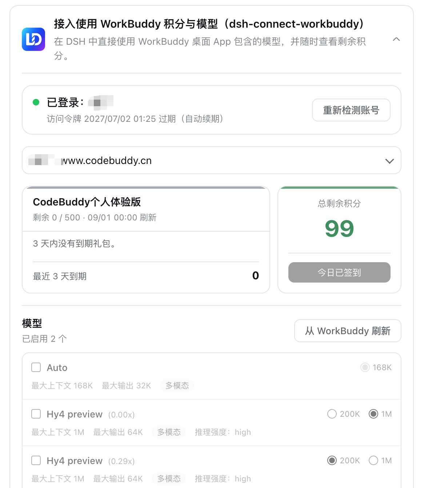

<p align="center">
  
</p>

<h1 align="center">dsh-connect-workbuddy</h1>

<p align="center"><b>Connect locally signed-in WorkBuddy models to DeepSeek Harness, with a read-only credits overview and model management.</b></p>

<p align="center">
  <a href="https://www.npmjs.com/package/dsh-connect-workbuddy"></a>
  <a href="https://www.npmjs.com/package/dsh-connect-workbuddy"></a>
  <a href="https://github.com/dingminhua/dsh-connect-workbuddy/actions/workflows/ci.yml"></a>
  <a href="LICENSE"></a>
  <a href="https://github.com/dingminhua/dsh-connect-workbuddy/stargazers"></a>
  <a href="https://dshfind.com/plugins/dingminhua/dsh-connect-workbuddy"></a>
</p>

[English](README.en.md) | 中文

A [DeepSeek Harness (DSH)](https://github.com/deepseek-ai/deepseek-harness) bundle plugin that connects locally signed-in WorkBuddy CN models to the DSH model picker, with a read-only credits overview and selectable model management.

## Features

- **WorkBuddy model provider** — registers locally signed-in WorkBuddy models as the `workbuddy` provider (e.g. `GLM-5.3`, `DeepSeek-V4-Pro`, `Kimi-K3`, `MiniMax-M3`, `Hy3`).
- **Model management** — refresh the full catalog from upstream and enable or disable each model individually; refresh is a draft operation that only takes effect on save. Upstream also reports credit multiplier, context/output limits, and reasoning efforts; image input is opted in per model manually (off by default).
- **Local account switching** — discovers the multiple sign-in credentials WorkBuddy's desktop app leaves behind and lets you switch between them. Tokens are never written to DSH settings.
- **Read-only credits overview** — remaining credit aggregated per package, plus each model's credit multiplier. Queries consume no credits.
- **Multi-candidate credential paths** — probes the platform defaults for macOS / Windows / Linux in turn, overridable by environment variable or directly in the card.
- **Secure loopback shim** — random port + in-process random secret; the real WorkBuddy token is never handed to pi-ai.
- **Command-line diagnostics** — `status` / `doctor` / `logout`, so sign-in, credits, and host health can be checked without a browser.

## How it works

```text
DSH PiAiAdapter
  -> secure loopback shim (random port + in-process random secret)
  -> WorkBuddyUpstreamClient
  -> https://copilot.tencent.com/v2/chat/completions
  -> WorkBuddy SSE
  -> DSH executes local tools and returns their results
```

The model catalog comes from `/console/enterprises/personal/models` and the credits overview from `https://www.codebuddy.cn/v2/billing/meter/get-user-resource`; both are read-only.

Credentials are read (read-only) from the WorkBuddy desktop app's own auth file. Refreshed tokens are kept separately in `$DSH_HOME/.workbuddy-auth.json`; the desktop app's file is never written.

## Install

Prerequisite: the WorkBuddy desktop app is installed and signed in (the plugin reuses the app's sign-in state).

```sh
dsh plugin --profile desktop add dsh-connect-workbuddy
```

Or directly via npm:

```sh
npm install dsh-connect-workbuddy
```

Restart the DSH process after install/update/uninstall.

The plugin also runs under **Web** and **TUI**; pick the command matching your profile:

```sh
dsh plugin --profile web add dsh-connect-workbuddy     # Web
dsh plugin --profile dsh-tui add dsh-connect-workbuddy # TUI
```

## Command line

```sh
dsh plugin --profile <web|desktop|dsh-tui> exec dsh-connect-workbuddy status   # sign-in state and remaining credit
dsh plugin --profile <web|desktop|dsh-tui> exec dsh-connect-workbuddy doctor   # credential paths and host diagnostics
dsh plugin --profile <web|desktop|dsh-tui> exec dsh-connect-workbuddy logout   # clear the plugin-held credential copy
```

`status` and `doctor` accept `--json` for machine-readable output.

## Development

```sh
pnpm install
pnpm run check   # typecheck + test + build
```

Local dev via a `link:` install to the desktop profile (restart DSH Desktop after editing):

```sh
dsh plugin --profile desktop add /Users/dmh2002/DshProject/dsh-connect-workbuddy
```

## Marketplace listing

The plugin ships an installable `dsh.bundle` manifest and is published to npm. Community marketplaces generally sync entries from the [Awesome DSH Plugin](https://github.com/awesome-dsh-plugin/awesome-dsh-plugin) registry; the submission draft lives at [`awesome-dsh-plugin-submission/dingminhua__dsh-connect-workbuddy.yml`](awesome-dsh-plugin-submission/dingminhua__dsh-connect-workbuddy.yml).

Marketplace screenshots and GitHub README badges are two separate mechanisms:

- **GitHub badges** are produced by the Shields/dshfind image links at the top of this README.
- **Marketplace screenshots** are controlled by the registry's `data/screenshots.json`; when unset, the marketplace falls back to extracting images from the README.
- **Marketplace icons/placeholders** follow each marketplace's own display rules; they are not a generic npm `package.json` field nor a README badge.

## Known limitations

- The plugin depends on WorkBuddy client endpoints (not an official public API), so a WorkBuddy update may require adjustments.
- **Account switching** relies on the historical auth files the WorkBuddy desktop app leaves behind (the app's own backups), not an official multi-account API. Following the app's current sign-in remains the default; switching is an explicit opt-in, and historical credentials can be invalidated by the app's cleanup or sign-out.
- Windows and Linux credential paths are derived from platform conventions and are not verified on real hardware; set `WORKBUDDY_AUTH_FILE` if yours lives elsewhere.

## Disclaimer

- This project is **for personal study and research only**. It drives only your own WorkBuddy account locally; do not use it commercially or beyond reasonable personal use.
- You must comply with WorkBuddy's terms of service. Any consequence of using this project (including account restriction, quota depletion, or service interruption) is your own responsibility.
- The author is not liable for any direct or indirect loss arising from the use or misuse of this project.
- This project is unaffiliated with and unendorsed by Tencent, WorkBuddy, or DeepSeek. Names appear solely to describe compatibility; their trademarks belong to their respective owners.

## Acknowledgements

This project builds on work others have published. Sources and licenses are credited honestly below; we hold that in genuine respect.

### Reference for the connection core

- [corrinehu/dsh-workbuddy-connect](https://github.com/corrinehu/dsh-workbuddy-connect) (MIT, Copyright (c) 2026 Corrine Hu) — **the principal reference for this project.** That project first validated a working WorkBuddy-to-DSH integration: desktop credential discovery and refresh, the upstream protocol and header conventions, loopback shim hardening, pi-ai provider assembly, and the status CLI were all studied from it. This project reimplements those proven capabilities while focusing on improving the experience.
- [Sliverkiss/workbuddy2api](https://github.com/Sliverkiss/workbuddy2api) (MIT) — reference implementation of the WorkBuddy upstream protocol (the `copilot.tencent.com` wire behavior), referenced via `dsh-workbuddy-connect`.

### Baseline for the plugin presentation and structure

- [dingminhua/dsh-connect-trae](https://github.com/dingminhua/dsh-connect-trae) (MIT, Copyright (c) 2026 LaoDing) — the plugin's presentation is kept consistent with it: the settings-card structure and interaction, the model-management (refresh → select → save) and account-selection model, the read-only host↔client route shape, and the npm release engineering.
- [dingminhua/dsh-subagent-default-model](https://github.com/dingminhua/dsh-subagent-default-model) (MIT, Copyright (c) 2026 LaoDing) — source of the `dsm-*` card style system, the `row.*` bilingual copy-key convention, and the brand icon, referenced via `dsh-connect-trae`.
- [franksong2702/dsh-codex-connect](https://github.com/franksong2702/dsh-codex-connect) (Apache-2.0) — reference for the DSH plugin structure and provider registration, referenced via `dsh-workbuddy-connect`. Its Apache-2.0 obligations are discharged separately in [THIRD_PARTY_NOTICES.md](THIRD_PARTY_NOTICES.md).

### Note

Copyright in each project above belongs to its respective author. This project follows a **learn-the-design, write-our-own-code** approach and does not copy any reference project's source wholesale; key modules are written independently and each file's header comment names the specific project and pattern it draws on. If you find an attribution missing or incorrect, please open an issue and we will correct it promptly.

## Third-party open-source dependencies

The open-source projects referenced here, together with their licenses and compliance notes, are recorded in full in [THIRD_PARTY_NOTICES.md](THIRD_PARTY_NOTICES.md). When introducing new WorkBuddy-related external dependencies or reusing code from other projects, update that file and honor the upstream licenses.

## License

This project is licensed under the [MIT License](LICENSE). Copyright: **Copyright (c) 2026 LaoDing**.
