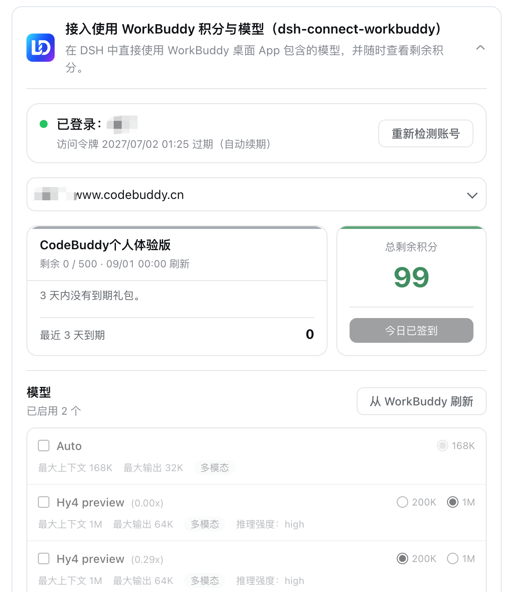
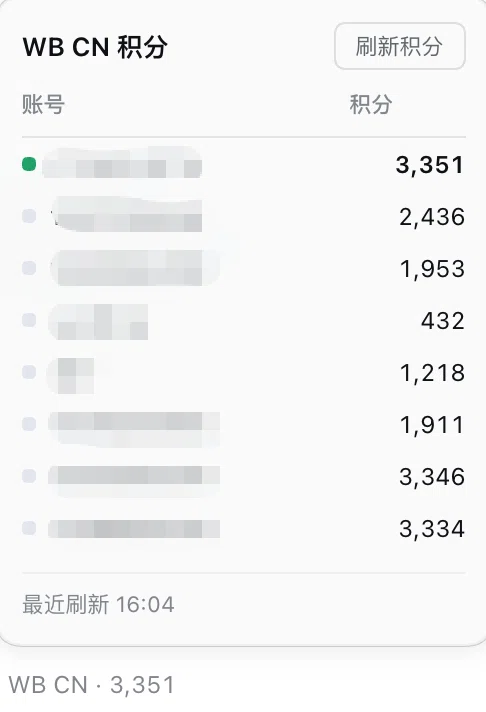
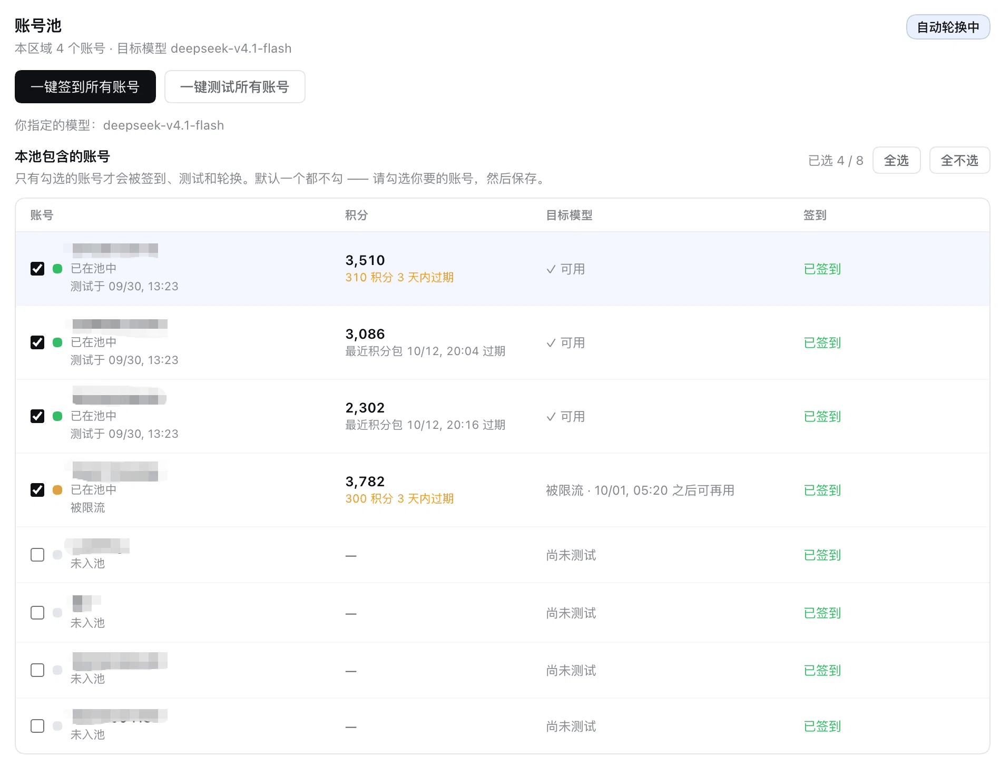

<p align="center">
  
</p>

<h1 align="center">dsh-connect-workbuddy</h1>

<p align="center"><b>Connect locally signed-in WorkBuddy models to DeepSeek Harness, with an account pool and model management.</b></p>

<p align="center">
  <a href="https://www.npmjs.com/package/dsh-connect-workbuddy"></a>
  <a href="https://www.npmjs.com/package/dsh-connect-workbuddy"></a>
  <a href="https://github.com/dingminhua/dsh-connect-workbuddy/actions/workflows/ci.yml"></a>
  <a href="LICENSE"></a>
  <a href="https://github.com/dingminhua/dsh-connect-workbuddy/stargazers"></a>
  <a href="https://dshfind.com/plugins/dingminhua/dsh-connect-workbuddy"></a>
</p>

[English](README.en.md) | 中文

A [DeepSeek Harness (DSH)](https://github.com/deepseek-ai/deepseek-harness) bundle plugin that connects locally signed-in WorkBuddy models to the DSH model picker — **both the CN app and the international WorkBuddy AI app are supported** — with an account pool and selectable model management. **The CN and international sides are two parallel providers (`workbuddy` / `workbuddy-global`) that can be used at the same time**; the settings card separates them with tabs for convenient management.

## Features

- **Dual parallel providers (CN + international)** — the CN side registers as the `workbuddy` provider (`GLM-5.3`, `DeepSeek-V4-Pro`, `Kimi-K3`, `MiniMax-M3`, `Hy3`, etc.), the international side as `workbuddy-global` (`GPT-5.6`, `Gemini-3.5-Flash`, `GLM-5.3`, `Kimi-K3`, etc.). **A region's models appear in the DSH model picker when that region has an account**: with accounts on both sides, both rosters are selectable at once, and different sessions can each pick a side without interfering. **A region with no local sign-in lists no models** — it cannot serve a single request, so listing them would offer nothing but failures. Sign in once for that region and its models come back on "detect accounts again" or after a restart; the provider itself stays registered either way, because its settings card is how you sign in (re-detection lives in the pool block). Model names carry the upstream credit multiplier (e.g. `GLM-5.3 · x0.79`), matching WorkBuddy's own model menu.
- **Tabbed settings card** — the card's top carries a "Domestic / Global" tab bar; each tab holds its own account pool and model management. Account, directory, selection, and unsaved drafts are fully isolated per tab — switching accounts or refreshing models on one tab never touches the other side's runtime catalog or sessions.
- **Switch either provider off on its own** — each tab carries an on/off checkbox (both checked by default). Unchecking one **withdraws that provider from DSH's model picker entirely** (it is not merely a hidden tab): its adapter route and its "Settings → Models" directory entry are both pulled, and startup no longer sends pointless requests for it. Account, credits, directory, and selection are all kept, and re-checking restores everything. The typical use is "I have no use for the international side" — switch it off and keep the picker clean. Note: a session that had already selected a model from the switched-off provider will report `NO_ADAPTER` on its next call; the card states this plainly on the switched-off tab instead of failing silently.
- **Model management** — refresh the full catalog from upstream and enable or disable each model individually; refresh is a draft operation that only takes effect on save. Upstream also reports credit multiplier, context/output limits, and reasoning efforts; **image input is decided by a vendor-verified table**: a refresh pre-checks only models the vendor's own documentation calls natively multimodal, leaves documented text-only models unchecked, and treats anything without a vendor source as unverified and unchecked rather than guessing. Upstream's `supportsImages` is a *platform* declaration, not the model's capability, so it does not drive that decision at all. You can still tick any box by hand, and your selection is kept locally. **Every model row also carries a “Can disable” (`off`) checkbox**: it decides whether that model gets the “turn thinking off entirely” level. The default comes from a reviewed built-in table (the 9 models that claim the capability but answer HTTP 400 for it start unticked), and you can change it per model — **untick** for a newly refusing upstream model, **tick** for one the table wrongly hides or you have verified works; your ticks are saved on first save and recomputed no further.
- **Model availability testing, including cooldown recovery times** — working out when a limited model frees up used to mean guessing through repeated failures. Now every model row has a **Test** button that gives you a direct answer for whether the model works right now and, if not, when it comes back. **It sends a real-volume request (about 25k input tokens)**, rather than "ping it and see if it answers" — because the upstream throttles on request **SIZE** (measured: about 20k tokens pass, about 30k are refused), so a small request looks fine while every request in a long conversation may be refused. That is exactly where "the test passes but I am limited" came from. **Where the recovery time comes from**: the upstream's 429 carries **no** `Retry-After` header (and no `X-RateLimit-*`), but it writes the reset time into the response **body** — `{"code":6004,"msg":"…将在 2026-09-30 02:30:30 UTC+8 重置…"}`. The plugin parses that time and converts it using the UTC offset the message states, so the result does not depend on your machine's timezone; the card then shows “✗ Rate limited · usable again after 2026/9/30 02:30:30”. When none of the sources states a time, the plugin **never invents a countdown** and says plainly that no time was given. A rate limit deliberately does **not** borrow the monthly refresh time, which would tell you to wait weeks for a limit that clears in seconds. Probes run in the Host, so **the credential never reaches the page**, and results are not written to settings — your saved selection is untouched.

  **Two things to know.** ① **It really does spend credits** — one measured probe reported `credit` 0.02 (a refused one 429s and costs almost nothing). So testing is **manual and per-model only**: there is deliberately no “Test selected” batch button, because sweeping the whole list from one click is an uncontrolled spend — and the Host enforces the same rule, **accepting a single model only** and refusing multi-model requests. ② The upstream advertises a 1M context yet throttles far below it, and the plugin advertises each model's **native** window to DSH (no longer clamped to 200K as of 3.5.0), so DSH compacts very late — hitting the throttle in a long session follows directly from that. To make DSH compact sooner, set a “DSH context budget” cap on the model's row (200K / 500K / the model's native window).
- **Local account switching** — discovers the multiple sign-in credentials WorkBuddy's desktop app leaves behind and lets you switch per region. Tokens are never written to DSH settings.
- **Credit readout in the composer toolbar (follows the selected model, per region)** — a clickable readout sits at the left of the composer toolbar (e.g. `WB CN · 1,072`) and **switches region automatically with the model this session is using**: pick a WB CN model and it shows the domestic balance, pick a WB AI model and it shows the international one; with any other provider's model it does not appear at all. It refreshes every 5 minutes and can also be refreshed by hand. Clicking it opens a panel: a **table of balances per account**, where clicking a row switches to that account (the same setting the card's account picker writes), and an account that cannot serve right now is **labelled in its row** (e.g. rate-limited, out of credits) using the same wording as the account-pool table. The per-account figures are fetched only while the panel is open, so the 5-minute background refresh never multiplies by the account count. To turn a side off, untick “Show WB CN / WB AI credits in the composer” in that region's tab on the card; while a region's provider is switched off, the readout disappears and its switch is disabled.

  
- **Account pool: batch actions across several accounts, plus automatic failover** — tick the accounts you want into a pool and you get **one-click check-in for every account**, **one-click testing of every account against a model you choose** (defaulting to the region's zero-multiplier free model), and with **Enable the account pool** switched on, **automatic failover**: a request that fails upstream is retried against the pool's other usable accounts, in order, until one serves it or none is left. Membership starts **empty and is an explicit opt-in**: "signed in on this machine" is not the same as "spend this account's credits and claim its rewards". The pool's **ranking decides who serves every request** (usable first, then higher credits, soonest-expiring, freshest credential), and on a failure the next usable member is tried. It **never writes back your saved selection** — switch the pool off and your own account applies again immediately. **The switch only decides whether the PLUGIN chooses** — with it off, the plugin stops picking and switching accounts for you, but check-in and testing stay available (they are manual actions). Testing reuses the model rows' real-volume probe, so it **does cost real credits**; **automatic check-in is deliberately not offered** — a check-in claims real rewards, so it only ever runs when you press the button. See [Account pool](#account-pool).
- **Actionable advice when a credential is refused** — when the upstream rejects the selected account's token, the plugin actually **probes** the other local sign-ins: if one still answers, it tells you to switch to it (with a one-click switch) instead of vaguely asking you to sign in again — re-authenticating fixes nothing while you are pinned to a revoked backup. Only when there is genuinely no other local account does it ask you to sign in again.
- **Add accounts by QR sign-in, import/export them in bulk, test or delete them one by one** — the WorkBuddy desktop app is no longer a prerequisite: the card's **Add account by QR code** opens an authorization link and signing in finishes in the browser. Every credential lands in the plugin's own vault (`$DSH_HOME/workbuddy-vault/<region>/<accountId>.json`, one file per account), and the desktop app's auth files stay **read-only and are never modified**. Each row of the account table gains **Test** and **Remove**: a row test reuses the same probe as the batch run, so the two are comparable; removing deletes only the copy the plugin stored, and an account that came from the desktop app reappears on the next scan. **Export / import accounts** moves credentials to another machine: pick accounts to export a JSON file → choose a file and read a **redacted preview** (field names and whether a token is present; the token itself never enters the preview) → tick what to import. An import overwrites per account rather than duplicating, and **only a record positively identified as belonging to that region is stored** — a domain the plugin cannot classify is skipped and counted as skipped. See [Account pool](#account-pool).
- **Credits live in the account pool** — the member table shows each account's remaining credits and nearest expiry, and credits are the ranking's second key (more credits serves first). The queries are **read-only** and consume no credits.
- **Multi-candidate credential paths** — probes the platform defaults for macOS / Windows / Linux in turn, overridable by environment variable or directly in the card. **When nothing is found, the card lists which paths were probed and why each one failed**: five distinct reasons (absent / unreadable / no usable token / encrypted with no key available / belongs to the other region), so the easiest case to misdiagnose — signed in, but the desktop app is not present — says the app must be there instead of telling you to sign in again. The **belongs to the other region** reason is different in kind: that sign-in is real and usable, it is simply filed under the other tab, so the card states the fix outright — switch tabs, no need to sign in again. The list says it once: the paragraph states the conclusion, the collapsed list supplies the per-path detail, and the two never repeat each other.
- **Secure loopback shim** — one random port + in-process random secret per region; the real WorkBuddy token is never handed to pi-ai.
- **Command-line diagnostics** — `status` / `doctor` / `logout`, reporting sign-in and credits per region, without a browser.

## How it works

```text
DSH PiAiAdapter (one stack per provider)
  -> secure loopback shim (one random port + in-process random secret per region)
  -> WorkBuddyUpstreamClient
  -> CN: https://copilot.tencent.com/v2/chat/completions
  -> Global: https://www.workbuddy.ai/v2/chat/completions
  -> WorkBuddy SSE
  -> DSH executes local tools and returns their results
```

The CN and international sides each own a complete runtime stack — credential store, model catalog, loopback shim, adapter — with visibility filtered by credential domain (`workbuddy.ai` / `codebuddy.ai` → international, anything else → CN), so **both regions' accounts can be signed in and used by different sessions at the same time**. The international product has two brand domains: the desktop app signs in at `workbuddy.ai`, while the CodeBuddy CLI signs in at `codebuddy.ai` — both are international.

The model catalog comes from each region's correct source, and both read the **same** `/v3/config` document the WorkBuddy app itself consumes; they differ only in which client identity requests it: CN uses the CodeBuddy CLI user agent, international uses the desktop user agent (the config service serves a different roster per client channel — only the CN CLI channel's roster carries the free `hy4-preview-f`, while the international side needs the desktop agent to get the account's real 20-model list, including the free `deepseek-v4.1-flash`). If CN cannot read `/v3/config`, it falls back to the legacy `/v2/enterprises/personal/models` and logs a line — that legacy roster is the CLI channel's, where the same slot carries the paid `hy4-preview` (`x0.29`) rather than the free `hy4-preview-f` (`x0.00`) the app shows, so it is used only while degraded. The credits overview comes from `https://www.codebuddy.cn/v2/billing/meter/get-user-resource` (international accounts auto-route to the global gateway their credential belongs to, `workbuddy.ai` or `codebuddy.ai` — tokens are not interchangeable across the two brand domains); all are read-only.

Credentials are read (read-only) from the WorkBuddy desktop app's own auth file. Refreshed tokens are kept per region in `$DSH_HOME/.workbuddy-auth.cn.json` and `$DSH_HOME/.workbuddy-auth.global.json` (two simultaneously signed-in accounts never overwrite each other; the legacy single file `.workbuddy-auth.json` is still read as a migration source); the desktop app's file is never written.

**Encrypted credential fields**: newer desktop builds (Windows first) replace the auth file's `accessToken` / `refreshToken` strings with an AES-256-GCM envelope (`{"$wbEncrypted":1,"envelope":"…"}`), and the account's **display name (`nickname`) is encrypted the same way** — left unopened it degrades to a bare uin number. The envelope is sealed with a field key **compiled into the app itself**, not a user secret — so the plugin ships no key copy. When it meets an encrypted document it runs the installed app with `ELECTRON_RUN_AS_NODE` and calls that app's own native binding (`electron_browser_workbuddy_storage.loggerGet()`) to fetch the same payload and derive the key locally: it asks the very build that wrote the file. The key is cached in process memory only — never on disk, never in logs. Plain-string documents (macOS, older Windows builds) take the original path and never spawn a child process. `account.phoneNumber` is encrypted there too, and the plugin deliberately **neither reads nor displays it**. If the app lives somewhere unusual, point `WORKBUDDY_APP_EXECUTABLE` at its executable.

## Account pool

<p align="center">
  
</p>

A machine usually carries more than one WorkBuddy sign-in. The **account pool** turns that into a single click: tick the accounts you want into the pool, then press **Check in all accounts** or **Test all accounts**; switch on **Enable the account pool** and the plugin will carry on through a failure by itself.

**Each region (domestic / international) has its own independent pool** — membership and target model never affect the other side, because the two sides' accounts belong to different upstream stacks.

### The two batch actions

- **Check in all accounts** — signs in account by account. It **reads today's status first**, so an account that is already checked in is marked as such and receives **no write request at all** (idempotent — no duplicate claims); a single account failing marks only that row and **never aborts the batch**.
- **Test all accounts** — sends one **real-volume** probe per member (about 25k input tokens; the same `probeModel` the model rows use, so it inherits both measured facts: throttling is triggered by request **size**, and the reset time is written into the response **body** rather than a header), reporting whether that account can serve that model right now.

**Which model is tested:** by default the **zero-multiplier free model in that region's catalog** (measured: the domestic catalog currently has exactly one, `hy3`; the name is deliberately **not** hard-coded, because the upstream changes multipliers — `deepseek-v4.1-flash` has already moved from 0 to 0.11), or a specific model you pick in the dropdown. If the model you named has left the catalog, the **manual action refuses outright** (`target-model-stale`) instead of quietly substituting another one — you asked to test *that* model, and swapping it answers a question you did not ask.

**Cost and boundaries:** testing is a real request. Pointed at the free model (multiplier 0) it costs virtually nothing, but it is **not a free no-op**; check-in claims that day's real reward. Both actions run **only when you press the button** — the plugin **does not offer automatic check-in**, and the card does not show a switch that can never be flipped.

### Membership is an explicit opt-in, empty by default

"signed in on this machine" is not "spend this account's credits and claim its rewards". Membership starts **empty** and must be ticked one by one (or with **Select all**); **an empty pool never degrades into "all accounts"** — with nothing ticked, both batch actions are refused rather than running every account on your behalf.

Ticking boxes is a **draft edit**: it lands on **Save**, the save button carries a dirty marker until then, and the draft survives switching tabs or closing the card.

### Automatic routing and failover: what "Enable the account pool" turns on

This plugin's standing rule is that it **never rewrites who pays** — your saved choice is yours. What the switch changes is **who serves**, decided by the pool's ranking, request by request:

1. **The ranking picks the serving account for every request** — so the card's "in use" account is the ranking's answer, which is not necessarily the one you picked above it. The ranking is below.
2. **On a failure the next usable member is tried**, then the next, until one serves it or none is left. Only then is the error reported — annotated with how many accounts were tried, so a pool that failed over and still lost does not read like a single account failing.
3. **Your saved selection is never rewritten.** Turning the pool off restores it immediately and completely (the pool steers through a runtime override, never through the settings). That is also why the card states which account is actually in use: it may be a different one, and you should be able to see that.
4. **Which failures trigger a retry:** 429 rate limits, 402 exhausted credits, 401 dead sessions, 502 gateway/network errors — all of these describe **one account's** state, and another may well survive them.
5. **Which do not:** a malformed request (HTTP 400). Every account answers the same 400, so walking the pool would only multiply the wait before the user sees an error they must act on anyway. A stream that dies **mid-flight** is not retried either — bytes are already on the wire, and replaying would splice two answers together.
6. **Members already known to be unusable are skipped** — a rate-limited account still inside its stated cooldown, or one whose credential the upstream rejected. **An account that was never tested counts as usable**: a freshly discovered sign-in must not be invisible just because nobody has measured it yet.
7. **A live failure is RECORDED as a measurement** (with the reset time the upstream stated), so the NEXT request starts from an available account instead of re-hitting the account that just refused it. Before this, only the manual batch test wrote measurements — so a just-limited account still read as untested and kept being picked first. HTTP 400 is the exception: that is the REQUEST being rejected, which says nothing about the account, and recording it would sideline a good one. Accounts not checked into the pool are not measured either, since the tick is what grants "you may spend this account's credits".
7. Every retry leaves a `warn` line in the host log naming the failure and the account that follows.

### What the switch actually controls

**It controls whether the PLUGIN decides by itself — not whether YOU may act.**

| | Pool **on** | Pool **off** |
|---|---|---|
| Who serves | Chosen **automatically** by the ranking (usable → credits → soonest-expiring → freshest credential) | The account you selected; the plugin does not choose |
| On a failure | **Automatically** retried on the next usable account | Reported as-is, no retry |
| Check-in all / test all | Available | **Still available** |
| Target test model | Editable | **Still editable** |

The last two rows are deliberate: check-in and testing are MANUAL actions over the members you ticked, which is a different question from "does the plugin route automatically". Gating them on the switch meant switching the pool off ALSO removed the ability to check in or test — while "off" should mean "I'll do it by hand", not "nothing is allowed".

**The one hard rule**: with nothing checked in the pool, batch actions are refused. An empty pool **never** degrades into "then run on every account" — that is the one reading which would spend credits you never authorized.

**Where manual selection lives**: in the account pool section. **With the pool off** that section shows an "Account in use" dropdown; picking one takes effect immediately (it writes the region's account slot through the same verified path the credential-recovery "switch to a usable account" action uses). **With the pool on the row is absent** — the ranking decides there, and a dropdown that changes nothing is worse than no dropdown. Account discovery ("detect accounts again"), membership, check-in and testing all sit in that one section, so accounts are managed in exactly one place.

### The ranking (what decides who serves)

1. **Usable first** — an account a measurement rules out (limited with its cooldown unexpired, credential rejected, upstream unreachable) sorts last and is not chosen;
2. **Higher credit balance first.** Credits take part **only when a fresh reading exists** (what the card's poll, a batch test or a save collected; valid for 10 minutes). The request path **never** fetches credits — that is an upstream call per member, and one page of chat would turn into N extra requests;
3. **Soonest-expiring credits first** — spend what lapses in three days before it is lost;
4. **Freshest credential first**;
5. The account id closes the order, making it **total** and reproducible rather than jittering with the roster's order.

### Why an account leaves the pool, and when it comes back

| Probe outcome | What it means for failover |
| --- | --- |
| Usable | Eligible |
| Rate limited | Out of the pool **temporarily**, returning on the reset time the upstream stated (and when it states none, the card says so rather than **inventing a countdown**) |
| Out of credit | Out of the pool, returning at the monthly package's refresh time |
| Credential rejected / model not found / upstream unreachable / failed | Out of the pool until a later probe refreshes the result |

The key line: **"rate limited" is not "unusable"**. It is precisely the state most worth waiting on — treating it as permanently dead throws away the accounts that would have served you best.

### Manual selection: there is no account dropdown any more

Accounts are managed **in the account pool**: membership checkboxes are the selection surface, and re-detection lives there too. The old "account" dropdown had become self-contradictory once the pool existed — with the pool on, the ranking decides who serves, so changing it did nothing yet looked authoritative, and the status line above could name one account while the dropdown showed another.

The region status line changed with it: **while the pool is on it does not name a single account** (several signed in at once is the normal case, so "Signed in: A" was simply the wrong claim) — it states that the region is usable and that the pool picks. **While the pool is off it does name the account**, because then it really is the only answer. The dot and the token expiry beside it are about "can this region be used", which is a different question from "who is being billed" — the pool block answers that one.

### Saving and drafts: why the card has two Save buttons

One for model management, one for the pool — **deliberately kept apart** rather than merged: the two draft domains differ, and merging them means one failed write drags the other down (a catalog that will not save would stop you saving pool preferences too); a shared Discard would also throw away both drafts on a single misclick. Both sides use a **verified write** — **a write that did not land never discards the draft**, or your edits are lost for good.

One class of state in the pool **does not go through a draft**: probe results, cooldowns, and the account that served a request. Those are **observations**, written frequently by the plugin itself. The reason is practical — drafts are overwrite-based, so if observations lived in one, a single manual **Save** could roll the result a timer had just written **back to a several-minute-old value**.

## Install

> ⚠️ **Version requirement: DSH 0.1.7-rc.1 or newer (current window: `0.1.7-rc.1` – `0.2.x`).** Since v2.1.0 this plugin only supports hosts on DSH 0.1.7-rc.1 and above (older hosts cannot resolve the dependencies to install this version); hosts on 0.1.5 and earlier should stay on v2.0.15. Since v2.1.2 the upper bound is **`<0.3.0-0`**: the **whole 0.2.0 line, GA included, is verified**; the 0.3.0 line is explicitly refused. See [Supported host range](#supported-host-range) below.

### Supported host range

DSH's shipped gate (`evaluatePluginCompatibility` in `packages/boot/app-boot/src/plugin-compatibility.ts`) checks every declared `dsh-*` peer range; **one unsatisfied peer skips the entire bundle** (it lands in `skippedBundles` and is only printed to stderr) — no provider is registered, no card appears, the model list goes empty, and the page shows no error at all.

| Host version | Verdict |
| --- | --- |
| `0.1.7-rc.1` – `0.1.7-rc.2` | ✅ supported |
| `0.2.0-rc.1` – `0.2.x` (`0.2.0` GA included) | ✅ supported (verified from 2.1.2) |
| `0.3.0-0` and above | ❌ explicitly refused (that line is unverified) |
| `0.1.6` and earlier | ❌ explicitly refused (0.1.5 users should stay on v2.0.15) |

> The upper bound is written `<0.3.0-0`, not `<0.3.0`: **every DSH tag to date is a prerelease** (`-alpha.N` / `-rc.N`), so `<0.3.0` alone would admit the entire unverified `0.3.0-alpha.1` / `0.3.0-rc.1` line, leaving the guardrail inert — exactly the defect shape 2.1.2 fixes. `tests/dsh-line.spec.ts` guards this contract.

> 🪟 **Platform support: Windows, macOS, and Linux are supported side by side.** **Windows is a first-class target**, not an afterthought: CI runs the full suite on `windows-latest`, and four areas carry Windows-specific branches with their own tests — credential paths, process heartbeat, desktop-app executable lookup, and settings writes. **When fixing a defect that only reproduces on Windows, the Windows reporter's field evidence and an encryption vector captured from a real Windows install are what the fix is judged against** (see the 2.0.6 / 2.0.11 / 2.0.12 sections of [CHANGELOG](CHANGELOG.md)). See the [Platform support](#platform-support) section for the per-platform differences and known limitations.

Prerequisite: the WorkBuddy desktop app is installed and signed in (the plugin reuses the app's sign-in state).

```sh
dsh plugin --profile desktop add dsh-connect-workbuddy
```

Or directly via npm:

```sh
npm install dsh-connect-workbuddy
```

Restart the DSH process after install/update/uninstall.

The plugin also runs under **Web** and **TUI**; pick the command matching your profile:

```sh
dsh plugin --profile web add dsh-connect-workbuddy     # Web
dsh plugin --profile dsh-tui add dsh-connect-workbuddy # TUI
```

## Platform support

All three platforms are supported targets; the differences below are **implementation facts**, not polite ways of saying "not yet supported". To change this section, change [`docs/WINDOWS.md`](docs/WINDOWS.md) too — that file is where platform-related constraints are registered.

| Aspect | Windows | macOS | Linux |
| --- | --- | --- | --- |
| Default credential directory | `%LOCALAPPDATA%` / `%APPDATA%` first, falling back to `<home>\AppData` when unset (so a redirected profile still resolves) | `~/Library/Application Support/CodeBuddyExtension/Data/Public/auth` | `$XDG_CONFIG_HOME` first, falling back to `~/.config` |
| Desktop-app executable | `%LOCALAPPDATA%\Programs\WorkBuddy`, `%LOCALAPPDATA%\WorkBuddy`, and both `Program Files` (located as `WorkBuddy.exe`) | Read from the bundle's `Info.plist` (`CFBundleExecutable`) — the real value is **`Electron`**, never guessed from the app name; covers the international `WorkBuddy AI.app` and apps filed under a subdirectory of `/Applications` | Not applicable (no corresponding app for encrypted credentials on Linux; point `WORKBUDDY_AUTH_FILE` at the credential) |
| Process-heartbeat timestamp source | PowerShell `Get-Process` `StartTime` (POSIX has no `ps -lstart` equivalent) | `ps -o lstart=` | `ps -o lstart=` |
| Child-process window | **`windowsHide` is required**: the host itself has no console (it is a GUI process), so without it every probe flashes a visible black window on screen | Not applicable (the option only takes effect on Windows) | Not applicable |
| Transient settings-file contention | **Does hit it**: an antivirus scanner / OneDrive / an editor locking the profile's `cordis.patch.yml` briefly makes the rename replace fail, and `@deepseek-ai/dsh-atomic-write`'s retries are enabled **only on `win32`** | Does not: POSIX rename replaces outright, so the same code never enters the retry branch | Same as macOS |
| CI coverage | `windows-latest`, full suite | The developer's own Mac | `ubuntu-latest`, full suite |

**Three Windows-specific things worth knowing**:

1. **An account change may fail to save** (the profile's `cordis.patch.yml` held open). The plugin **reads the value back after writing**: it reports "cleared" only once the write is confirmed on disk, and otherwise reports the failure and keeps your previous choice. Close whatever holds the file and retry. See [Known limitations](#known-limitations).
2. **Credential paths are partly verified on real Windows hardware.** The candidate list is derived from platform conventions and pinned by unit tests (including both the unset and the blank-string fallback for `LOCALAPPDATA` / `APPDATA`). On a real Windows 11 machine, `%LOCALAPPDATA%\CodeBuddyExtension\Data\Public\auth` and `%LOCALAPPDATA%\Programs\WorkBuddy\WorkBuddy.exe` **did resolve**, and the encrypted credential's `keyId` matched the registered vector verbatim. **The remaining candidates are still not verified per-item** — if your credential or app lives elsewhere, point `WORKBUDDY_AUTH_FILE` / `WORKBUDDY_APP_EXECUTABLE` at it and please report what you see.
3. **Encrypted credentials (from 5.6.0) require the desktop app to be present**, on Windows exactly as on macOS; if the app lives in a custom directory (e.g. `E:\WorkBuddy\WorkBuddy.exe`), point `WORKBUDDY_APP_EXECUTABLE` at it.

## Command line

```sh
dsh plugin --profile <web|desktop|dsh-tui> exec dsh-connect-workbuddy status   # sign-in state and remaining credit
dsh plugin --profile <web|desktop|dsh-tui> exec dsh-connect-workbuddy doctor   # credential paths and host diagnostics
dsh plugin --profile <web|desktop|dsh-tui> exec dsh-connect-workbuddy logout   # clear the plugin-held credential copy
```

`status` and `doctor` accept `--json` for machine-readable output.

## Development

```sh
pnpm install
pnpm run check   # typecheck + test + build
```

Local dev via a `link:` install to the desktop profile (restart DSH Desktop after editing):

```sh
dsh plugin --profile desktop add /Users/dmh2002/DshProject/dsh-connect-workbuddy
```

## Marketplace listing

The plugin ships an installable `dsh.bundle` manifest and is published to npm. Community marketplaces generally sync entries from the [Awesome DSH Plugin](https://github.com/awesome-dsh-plugin/awesome-dsh-plugin) registry; the submission draft lives at [`awesome-dsh-plugin-submission/dingminhua__dsh-connect-workbuddy.yml`](awesome-dsh-plugin-submission/dingminhua__dsh-connect-workbuddy.yml), and the formal submission is PR [#3812](https://github.com/awesome-dsh-plugin/awesome-dsh-plugin/pull/3812) (`data/plugins/dingminhua__dsh-connect-workbuddy.yml`, CI and Submission gate green, awaiting maintainer merge).

**Listing directory rules** (per [contributing.md](https://github.com/awesome-dsh-plugin/awesome-dsh-plugin/blob/main/contributing.md)):

- One YAML per plugin: `data/plugins/<owner>__<repo>.yml` with `url` (exactly matching the repo), `name` (`owner/repo`), `category` (one of the valid values; this project uses `model`), and `description.en` (required, ending with a period) / `description.zh` (optional); a description containing `: ` must be quoted.
- The repo must declare a `dsh.bundle` manifest (here `dsh.bundle.patch: ./cordis.patch.yml`) and carry the `dsh-plugin` topic; the ≥ 10 commits and ≥ 1 day age are checked automatically by CI.
- Both READMEs (`README.md` / `README.zh.md`) are generated — never edit by hand; after changing the YAML, regenerate with `node scripts/generate-readme.mjs`.
- At most 3 entries per PR; change only your own entry, never touch other plugins.

Marketplace screenshots and GitHub README badges are two separate mechanisms:

- **GitHub badges** are produced by the Shields/dshfind image links at the top of this README.
- **Marketplace screenshots** follow the current convention and are declared in the plugin's own root [`screenshots.json`](screenshots.json) (this project declares its usage-card screenshot there). The registry's `data/screenshots.json` is a legacy fallback and **no longer accepts new keys** (this project removed its edit before submitting).
- **Marketplace icons/placeholders** follow each marketplace's own display rules; they are not a generic npm `package.json` field nor a README badge.

## Known limitations

- The plugin depends on WorkBuddy client endpoints (not an official public API), so a WorkBuddy update may require adjustments.
- **Account switching** relies on the historical auth files the WorkBuddy desktop app leaves behind (the app's own backups), not an official multi-account API. Following the app's current sign-in remains the default; switching is an explicit opt-in, and historical credentials can be invalidated by the app's cleanup or sign-out.
  - If an explicitly selected account disappears locally (the app replaced its login or cleaned up its backups), the plugin does **not** silently switch to another account — that would bill a different account. The card says the saved account no longer exists; pick an account again, or use "Follow the app's sign-in" to clear the saved choice. **Signing in again in the desktop app will not fix this**: the credentials are fine, it is the saved account id that no longer matches.
  - Users upgrading from before 2.0.0 may still carry the old top-level `accountId` (the migration source). It applies only to its own region and **stops applying once that region is explicitly cleared (`accounts.<region> = ""`)** — otherwise the account you cleared would be silently restored at the next startup. The card shows whether a region is "using the saved account" or "following the app's current sign-in": the restored default is usually the very account you just cleared, so without that line there is no way to tell a successful clear from a no-op.
- **On Windows, an account change may fail to save while the profile's `cordis.patch.yml` is held open.** DSH updates that file by writing a temp file and replacing the target; an antivirus scanner, a sync client (OneDrive), or an open editor can lock it briefly, and once the replacement retries are exhausted the failed write does **not** make `set()` reject. The plugin therefore reads the value back after writing: it shows "cleared" **only once the write is confirmed on disk**, and on failure it reports the error and keeps your previous choice (never a false confirmation that the old selection silently contradicts). Close whatever holds the file and retry.
- Windows and Linux credential paths are derived from platform conventions. On a real Windows 11 machine, `%LOCALAPPDATA%\CodeBuddyExtension\Data\Public\auth` and `%LOCALAPPDATA%\Programs\WorkBuddy\WorkBuddy.exe` **did resolve**, but **the remaining candidates and the Linux paths are still not verified on real hardware**; set `WORKBUDDY_AUTH_FILE` if yours lives elsewhere.
- **Encrypted credentials require the desktop app to be present.** Newer desktop builds (**from 5.6.0, on macOS as well as Windows**) encrypt the token fields in the auth file, and the plugin needs that app's own native binding to obtain the field key. If the app is not installed, was uninstalled, or lives outside the probed paths (on Windows the install registration is consulted automatically, so a non-default install is found without configuration; set `WORKBUDDY_APP_EXECUTABLE` if that misses too), an encrypted file cannot be read — the account then shows as signed out, and the plugin **never** degrades into emitting a truncated token. `doctor` reports whether this capability is available. The key is a build-time constant that may rotate with app releases; the plugin fetches it from the local app each run and caches nothing on disk, so an app upgrade needs no plugin upgrade.
  - **The executable is located from the bundle's own declaration, not guessed from the app name.** The WorkBuddy macOS bundles declare `CFBundleExecutable` as `Electron` (not `WorkBuddy`), so the plugin reads each bundle's `Info.plist` to learn the binary's name. Both the domestic `WorkBuddy.app` and the international `WorkBuddy AI.app` are candidates, and an app filed into a subdirectory of an applications folder (e.g. `/Applications/IDE/WorkBuddy.app`) is found by a one-level scan that confirms each candidate's bundle identifier before use — so a different Electron app can never be launched by mistake.
  - **"Signed out" and "your sign-in cannot be read" are reported separately.** When an encrypted file cannot be read, the advice is to install the desktop app or point `WORKBUDDY_APP_EXECUTABLE` at it — **not** to sign in again, which cannot help: the credential is fine, the key is what is missing.
- **A 403 "request illegal" (code 11140) is a server-side policy refusal, not a sign-in problem.** The chat gateway sometimes refuses a request outright under its content policy; the body reads `{"code":11140,"msg":"request illegal","requestId":"…","displayMsg":{"en":"The content did not pass the safety review. Please adjust and retry."}}`. The plugin used to file this under the generic `client` error (HTTP 400), which DSH then displayed as an AUTH failure — it looked like a broken sign-in, but **signing in again cannot fix it**: the credentials are fine; it is this one request that was refused. The refusal now passes through as 403 with the official message, `code 11140`, and the `requestId` (give that to official support). The `error.code` written back to the host is the stable class `policy_reject` rather than the numeric `11140`: the host decides in-place retrial from that class, and a policy refusal is deterministic — retrying only burns the budget, and `11140` is not a word the host knows, and the per-model "test" reports "refused by the server's content policy" instead of "token refused". Two ways out: send the same prompt from the WorkBuddy desktop app with the same account (if the desktop app is refused too, the limit is on the account/content side), or switch region/account and retry.

## Disclaimer

- This project is **for personal study and research only**. It drives only your own WorkBuddy account locally; do not use it commercially or beyond reasonable personal use.
- You must comply with WorkBuddy's terms of service. Any consequence of using this project (including account restriction, quota depletion, or service interruption) is your own responsibility.
- The author is not liable for any direct or indirect loss arising from the use or misuse of this project.
- This project is unaffiliated with and unendorsed by Tencent, WorkBuddy, or DeepSeek. Names appear solely to describe compatibility; their trademarks belong to their respective owners.

## Acknowledgements

This project builds on work others have published. Sources and licenses are credited honestly below; we hold that in genuine respect.

### Reference for the connection core

- [corrinehu/dsh-workbuddy-connect](https://github.com/corrinehu/dsh-workbuddy-connect) (MIT, Copyright (c) 2026 Corrine Hu) — **the principal reference for this project.** That project first validated a working WorkBuddy-to-DSH integration: desktop credential discovery and refresh, the upstream protocol and header conventions, loopback shim hardening, pi-ai provider assembly, and the status CLI were all studied from it. This project reimplements those proven capabilities while focusing on improving the experience.
- [Sliverkiss/workbuddy2api](https://github.com/Sliverkiss/workbuddy2api) (MIT) — reference implementation of the WorkBuddy upstream protocol (the `copilot.tencent.com` wire behavior), referenced via `dsh-workbuddy-connect`.
- [hawklithm/workbuddy2api](https://github.com/hawklithm/workbuddy2api) (MIT, Copyright (c) 2026 Mayer) — **the only entry in this list that is a CODE PORT rather than a design reference**: its `src/codebuddy_proxy/dsml_parser.py` is a DSML tool-call parser for a proxy in front of the same WorkBuddy/CodeBuddy upstream, and this project ported it to `src/dsml-recovery.ts` (the tag state machine, ignored-region detection, missing-wrapper repair, recursive parameter parsing, and the streaming buffer), adding the two gates it does not have (a tool name must be declared in THIS request; no declared tools means no recovery at all). The three deliberate deviations are listed in that file's header; the formal attribution is in [THIRD_PARTY_NOTICES.md](THIRD_PARTY_NOTICES.md).

### Baseline for the plugin presentation and structure

- [dingminhua/dsh-connect-trae](https://github.com/dingminhua/dsh-connect-trae) (MIT, Copyright (c) 2026 LaoDing) — the plugin's presentation is kept consistent with it: the settings-card structure and interaction, the model-management (refresh → select → save) and account-selection model, the read-only host↔client route shape, and the npm release engineering.
- [dingminhua/dsh-subagent-default-model](https://github.com/dingminhua/dsh-subagent-default-model) (MIT, Copyright (c) 2026 LaoDing) — source of the `dsm-*` card style system, the `row.*` bilingual copy-key convention, and the brand icon, referenced via `dsh-connect-trae`.
- [franksong2702/dsh-codex-connect](https://github.com/franksong2702/dsh-codex-connect) (Apache-2.0) — reference for the DSH plugin structure and provider registration, referenced via `dsh-workbuddy-connect`. Its Apache-2.0 obligations are discharged separately in [THIRD_PARTY_NOTICES.md](THIRD_PARTY_NOTICES.md).

### Note

Copyright in each project above belongs to its respective author. This project follows a **learn-the-design, write-our-own-code** approach and does not copy any reference project's source wholesale; key modules are written independently and each file's header comment names the specific project and pattern it draws on. If you find an attribution missing or incorrect, please open an issue and we will correct it promptly.

## Third-party open-source dependencies

The open-source projects referenced here, together with their licenses and compliance notes, are recorded in full in [THIRD_PARTY_NOTICES.md](THIRD_PARTY_NOTICES.md). When introducing new WorkBuddy-related external dependencies or reusing code from other projects, update that file and honor the upstream licenses.

## License

This project is licensed under the [MIT License](LICENSE). Copyright: **Copyright (c) 2026 LaoDing**.
